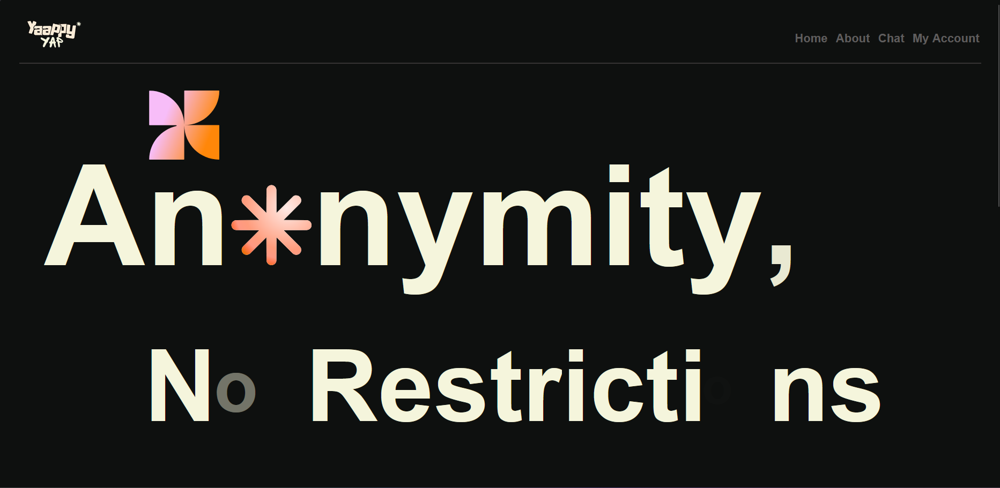
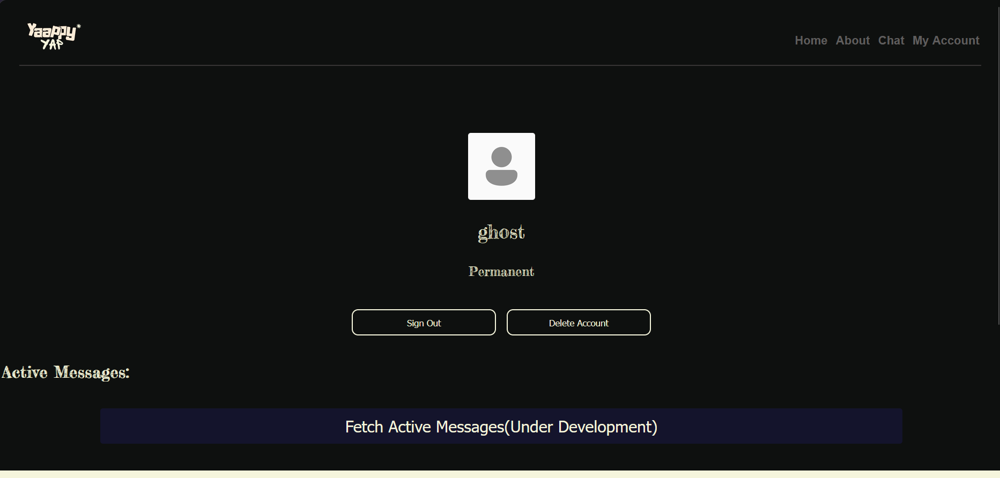
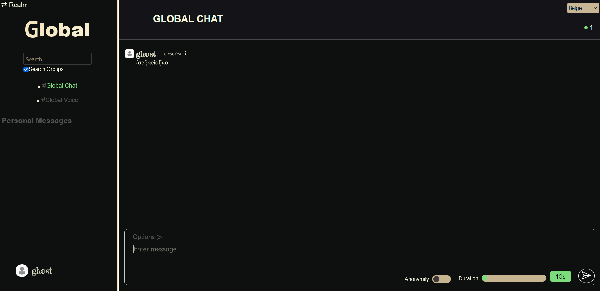
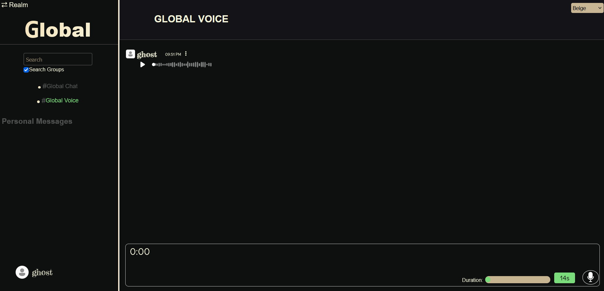
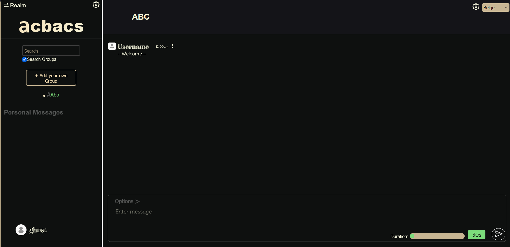

# Yappy Yap

## Motivation and Journey
I started this project in july 2025 because I wanted to learn cool animations on sites, well I did not do that much but I used gsap to create some animations and then I realized I need to learn backend so I thought about this idea of yappyyap and used my animations design but learnt backend and iterated over this project over time. At first I had the idea to just work with authentication and then websockets and messages came to mind. But there was no wow factor so I thought of anonymity feature and that msgs disappear after a time. You could go even anonymous with usernames. And I thought about this idea that current chating platforms have, we do not have any 100% proof that our messages are not used. So as this is open source I used cron jobs to clear databases which was a feature but it also helped me reduce the cost of deployment. Well then I converted this to microservices, tried to used redis but failed. So I left this project and moved on. 
But past month I remembered and decided to work as compared to before my skills got very good. So I went all in and created a full groups architecture. The idea is kind of derived from slack, space and channels. Here I had global realms and groups only. So I thought and converted the architecture such that realms and inside groups and now user could create multiple groups as compared to before. And then I used redis in each service which I had failed last year but this time I succeeded. And that made me realize how much I have progressed over the years. And yeah I rushed the project at end for error solvings so used claude code as converting development urls to production or minor bugs tracing that my eye could have not found, it helped me found those.

Well my next step is to create a desktop version of it so stay tuned.

## A guide to use
 - The personal messages of the site are in beta feature. There are some errors that are continuosly persisting but they are being solved as soon as found.
 - The whole site is kinda in beta feature, so if you reach an error or unreachable state, please referesh the page. A good feedback will be very much appreciated.
 - For trying the dms it is recommended to use two different devices.
 - Most of the features are listed below.

## Detailed Explanation of Features And My Learning

 - You can specify time for each of your message and it will be deleted after the specified amount of time from the chat and also from our database though it might take some seconds as you can see by reviewing the two scheduler folders Scheduler1 and Scheduler2 in the Backend folder which do the clean up jobs.

 - On the chat page you can also see an anonymity button that will hide your identity by sending your messages with anonymity "on" option in linkage to a dummy username.

 - A user can create a realm which is kinda of a separate space having groups in it, and groups can be created inside of their choice type of messages with some features of allowing live count, anonymity, number of members and the duration.

 - Guests get 5 minutes of session only and permanent users get 30 minutes

 - The owner can also specify of how other users can join their group, free join or invitation only. And then they can send invitations to other users to join their group.

 - The owner and admins can search and invite users by invitation links or direct add members if possible. The owner and admins can remove users too. Owner can change ownership, make admins.

 - The owner and admins can edit the settings of groups and realms

 - By default all users are included in the one main realm, global realm having two channels, voice and a text one.

### Note:
 - The voice is group is very slow as of now and is under development so it is just a beta feature of the application, especially for the custom realms as their is processing of audio files done so that takes time making them very slow, so be ready with lots of patience while testing or trying them.

 - Basic searching of users and groups. User can join the free groups by searching or direct message users also by searching by their usernames.

 - User can also click on the three dots to send personal dm message to another user. For persoanl messages, sender can specify type of duration. If set to true(default duration), expire duration will start counting from current time. If default duration is turned off, expiration of the message(duration length) starts when the user becomes online once.

 - For non default duration, duration will not stop if the user becomes online once and then goes offline again.

 - The user can login with google if they have an account

 - There is option to register as both guests and permanent users although both gets different time sessions that are made short for user's own benefit.

 - You can also read more about the features and constraints on terms page of the site.

 - The website also has an admin dashboard. It is not among the best but it does what is required and of course it is authorized to admins only.

 - This website contains a lot of animations and to be honest a large chunk of my time was taken developing those but I learnt from them and now I can make animations much easier.

## Optimization
 - The main and most important optimizations are the schedulers services deployed as microservices along side the backend. Their code can be seen in /Backend/Scheduler folders. They delete the old messages regularly ensuring that there are no expired messages which ensure that there is less database storage used and less search operations as the expired messages are removed.
 - Max lenght of duration of a message is 5 minutes so if n messages were sent in 5 minutes and therefore n squared in 25 minutes. But the messages are removed, making search space n again. This grows exponentially as time increases

 - Micro services are used, each deployed as a separate service isolated from others. It isolates services of groups, dms, 2 global realms and dashboard with separate database servers making backend end points and database sessions light weight, less traffic and therefore fast.
 - Redis manager is setted in each microservice that handle msgs. Although in production I deployed only one instance for each but they can be scaled to multiple instances and then redis manager is used for communication between different instances.

## Usage of AI
 - The below ai usage was before this current month development. Currently all the work done by AI is also commited by claude as contributor except one commit to help me normalize my group and realm variables which I specified was done by using claude. No other ai usage as far as I can remember.
 - AI was used to very least extent and even then when I used it I made sure that I try something different than what AI assumes the solution to be in an effort to make this project as least AI slop as possible.

## Running your instance
If you are interested in deploying this project on your own to create your own server kind of.
- Clone the repository.
- Navigate to Backend folder and set up the environment variables.
DB_USERNAME, DB_PASS, API_KEY, EMAIL, PRIVATE_KEY, DB_URL, AUTH_DATABASE_URL, AUTH_USER, AUTH_PASS, PERSONAL_DATABASE_URL, TCHAT_DATABASE_URL, ABASE_URL, VCHAT_DATABASE_URL, TCHAT_USER, TCHAT_PASS, GOOGLE_CLIENT, CLIENT_SECRET 
- Note that you can do dummy values for variables such as google log in ones.
- The api key and email are from resend, so you need to configure that.
- I set up local environment in such a way that I use the commented out verify session token function so there is no need for authentication setup until I move it to production.
- After setting vars, run `docker compose up -d` from the folder.
- Then navigate to \Frontend\YappyYap\src\ and configure the backend service urls in config.js

## Images

